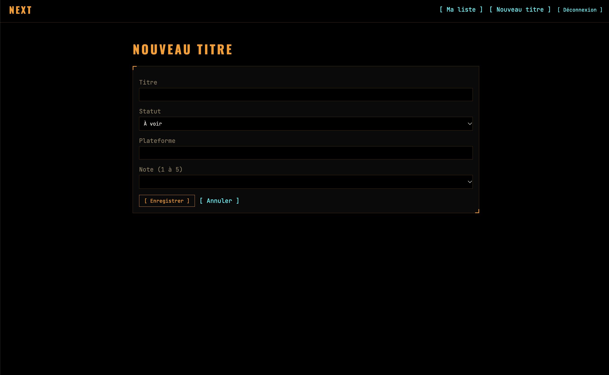

# Next

A personal watchlist for movies and TV shows. Track what you want to watch, what you're watching and what you've watched, with a rating and the platform for each title.

**Live demo: https://next.tremic.fr** (click **[ Essayer sans compte ]** to sign in as a guest, no account needed)


## The problem

Mental notes and screenshots of titles don't survive the following week. Next keeps one place for what you want to watch, what you've seen and what you thought of it.

## Features

- Guest login: a one-click demo account so anyone can try the app without signing up
- Email and password authentication with Devise
- Entries CRUD: add, edit and delete titles with a status (to watch, watching, watched), a rating from 1 to 5 and a platform
- Per-user data: each user only sees and edits their own entries
- Playlist data model (UI coming soon)
- Custom "NERV terminal" design system: orange on black, Oswald and JetBrains Mono, corner-bracket panels, LED status indicators

## Roadmap

- [ ] Playlists: create, rename, delete, add and remove entries
- [ ] Pundit authorization policies
- [ ] TMDB search with autocomplete, posters and metadata
- [ ] Live interactions with Stimulus (mark as watched, filters without page reload)
- [ ] Viewing statistics dashboard in Vue.js
- [ ] AI suggestion of the next title to watch (ruby_llm)

## Tech stack

| Area | Tools |
| --- | --- |
| Backend | Ruby 3.3, Rails 8.1, SQLite |
| Authentication | Devise |
| Authorization | Pundit (installed, policies coming) |
| Frontend | Hotwire (Turbo and Stimulus), Vue 3, Vite Rails |
| Quality | Minitest, Rubocop, GitHub Actions CI |
| Deployment | Docker, Kamal, Nginx on a VPS |

## Getting started

Requirements: Ruby 3.3, Node 20+ and Bundler.

```bash
git clone git@github.com:mtremauville/next_app.git
cd next_app
bundle install
npm install
bin/rails db:setup   # creates the database and seeds the guest user
bin/dev
```

Then open http://localhost:3000.

## Tests and linting

```bash
bin/rails test
bundle exec rubocop
```

## Workflow

- `main` is protected and deployed: changes go through a pull request with a green CI
- `dev` is the integration branch
- Every feature lives in a `feature/*` branch opened as a pull request against `dev`
- Commits follow the Conventional Commits prefixes (`feat:`, `fix:`, `docs:`, `chore:`...)
- Deployment: `kamal deploy` from `main`

## Author

Mickael Tremauville, junior full-stack developer (Ruby on Rails, Vue.js), Le Wagon alumnus.

- Blog: https://tremic.fr
- LinkedIn: https://www.linkedin.com/in/mickael-tremauville
- GitHub: https://github.com/mtremauville
